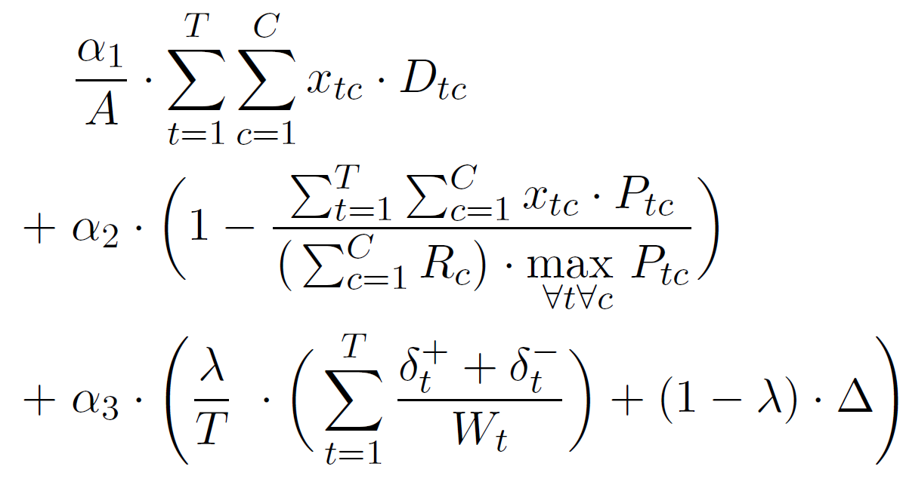

# Teacher Assignment

A Python-based tool for automatically creating assignment plans for mountain bike instructors. The program formulates the assignment problem as a mixed-integer linear optimization problem and compares two optimization approaches: [PuLP](https://coin-or.github.io/pulp/) with the CBC solver and [Z3](https://github.com/Z3Prover/z3) with the vZ extension.

## Project Overview

The project solves a real-world **Teacher Assignment Problem (TAP)**: mountain bike instructors need to be assigned to courses at geographically different locations while considering their availability, course overlaps, preferences, desired workload, and travel distance.

The assignment problem is formulated as a **Mixed-Integer Linear Programming (MILP)** problem. The objective function combines three criteria:

1. The distance instructors need to travel
2. The instructors' preferences for their assigned courses
3. The deviation between their desired and assigned workload

The relative importance of these criteria can be configured by the user through custom weighting parameters.

The project was developed as part of my Bachelor's thesis:

> **Finding optimal solutions to a Teacher Assignment Problem using MILP- and SMT-Solvers**

The thesis investigates and compares two approaches for solving the problem using **PuLP/CBC** and **Z3 with the vZ extension**. In the evaluation, PuLP with CBC proved to be considerably faster for the problem at hand and was therefore used for the final version of the program. 
## Features

- Automatic creation of instructor assignment plans
- Consideration of instructor availability and course overlaps
- Consideration of instructor preferences
- Consideration of desired instructor workloads
- Minimization of total travel distance
- Configurable weighting of optimization criteria
- Ability to enforce specific instructor-course assignments
- Excel-based input and output
- Graphical user interface using Tkinter
- Statistics for analyzing generated assignment plans
- Two alternative optimization approaches:
  - PuLP with the CBC solver
  - Z3 with the vZ extension

## Input

The program requires two Excel files.

### 1. Coordinates

The coordinates file contains two sheets:

- `guides`
- `events`

These sheets must be kept up to date and complete.

Starting from row 3:

- The first column contains the name of the guide or event location.
- The second column contains the latitude/longitude coordinates separated by a comma.

The coordinates do not need to be exact. The remaining rows and columns can be used for notes.

**Tip:** In Google Maps, right-click on the map, left-click on the displayed coordinates, and paste them into the Excel sheet with `Ctrl+V`.

### 2. Scheduling Preferences

The scheduling preferences file contains two sheets:

- `Anzahl Wunschtage`
- `Übersicht Terminwünsche`

#### `Anzahl Wunschtage` (= number of desired workdays)

Starting from row 3:

- The first column contains the names of the guides.
- The second column contains the desired number of working days for each guide.

The sheet must be complete. Guide names must match the names used in the coordinates file.

#### `Übersicht Terminwünsche` (= overview of workday preferences)

Starting from row 3, each row represents one event.

**3.1** Column `A` defines the ID of an event. The ID can be chosen freely, but must be unique.  
*Tip: Number the events consecutively starting from 1.*

**3.2** Column `B` defines the course location. This must match a location name in `Koordinaten.xlsx`.

**3.3** Column `C` defines the number of days the event lasts.

**3.4** Column `D` defines the number of guides required for the event.

**3.5** Column `E` defines the events with which this event overlaps in time. If overlapping events exist, their IDs must be specified. It is sufficient to list only events that are defined later in the table.

Multiple IDs must be separated by semicolons (`;`).

**3.6** Columns `G` to `J` list the guides available for the event.

If multiple names are listed in a cell, they must be separated by commas (`,`).

- Column `G`: guides with the lowest priority
- Column `H`: guides with medium priority
- Column `I`: guides with high priority
- Column `J`: guides who must be assigned to this event

The guide names must match those in the coordinates file and in the `Anzahl Wunschtage` sheet.

## Running the Program

Right-click `run.py` and select **Open with Python**.

A small window will open. Select:

1. The two input files described above
2. The desired location for the output file

Optionally, use the **Custom weights** button to choose your own weighting parameters.

Then click **Compute**.

The computation time depends strongly on the problem size. Under normal circumstances, the calculation should take a few seconds. In the worst case, the program runs until the configured time limit of 10 minutes.

## Custom Weights

If the default weighting is not used, the program optimizes the following variables:

**Variable 1:** Deviation between desired and assigned working days

**Variable 2:** Total distance travelled by the guides to their assigned course locations

**Variable 3:** Average guide preference

The importance of these variables relative to each other can be adjusted.

By default, a `1-1-1` weighting is used.

For example:

- `1-2-1` gives distance twice the importance of the other criteria.
- `1-1-0` ignores the preference criterion.
- `1-1-1` is equivalent to `2-2-2`.

The weighting determines which assignment plan the program considers the best and therefore selects for the output.

## Output

After the calculation is complete, the output is saved as an Excel file at the specified location.

Assigned guides are marked in different colors according to their preference for the respective course.

For each assignment plan, a second sheet contains statistics with useful information for analyzing the solution.

The output allows users to inspect the generated assignment plan and understand the factors that influenced the result.

## Cost Function

The optimization minimizes a cost function combining travel distance, guide preferences, and workload deviation.

The weighting parameters allow the user to adjust how strongly the individual criteria influence the resulting assignment plan.

## Technical Details

The project is implemented in **Python**.

### GUI

The graphical user interface was created using **Tkinter**.

### Optimization

Two different approaches are implemented:

#### PuLP + CBC

[PuLP](https://coin-or.github.io/pulp/) is used to formulate the optimization problem in Python. The CBC solver is used as the underlying MILP solver.

#### Z3 + vZ

The second approach uses [Z3](https://github.com/Z3Prover/z3) together with the vZ extension to formulate and solve the optimization problem as an SMT-based optimization problem.

The two approaches were implemented independently in order to compare their performance and to verify that they produce consistent optimal solutions where applicable.

## Testing and Evaluation

The repository contains automatically generated test scenarios for evaluating the performance of the different optimization approaches.

The evaluation showed that **PuLP with CBC was considerably faster than Z3 with vZ** for the investigated problem. For typical problem sizes, CBC was able to find an optimum within a few seconds, while vZ became impractical at significantly smaller problem sizes. For the tested scenarios, a typical problem size of 13 took approximately 6 seconds with CBC.

The generated assignment plans were also found to be sensible when compared with manually created plans from previous years. With the standard weighting, the automated approach reduced travel distance while keeping the other criteria at a comparable level.

## Thesis

The full Bachelor's thesis is included in the repository:

**Finding optimal solutions to a Teacher Assignment Problem using MILP- and SMT-Solvers**

University of Innsbruck, 2022.

## License

Copyright Benedikt Schenk, 2022.
